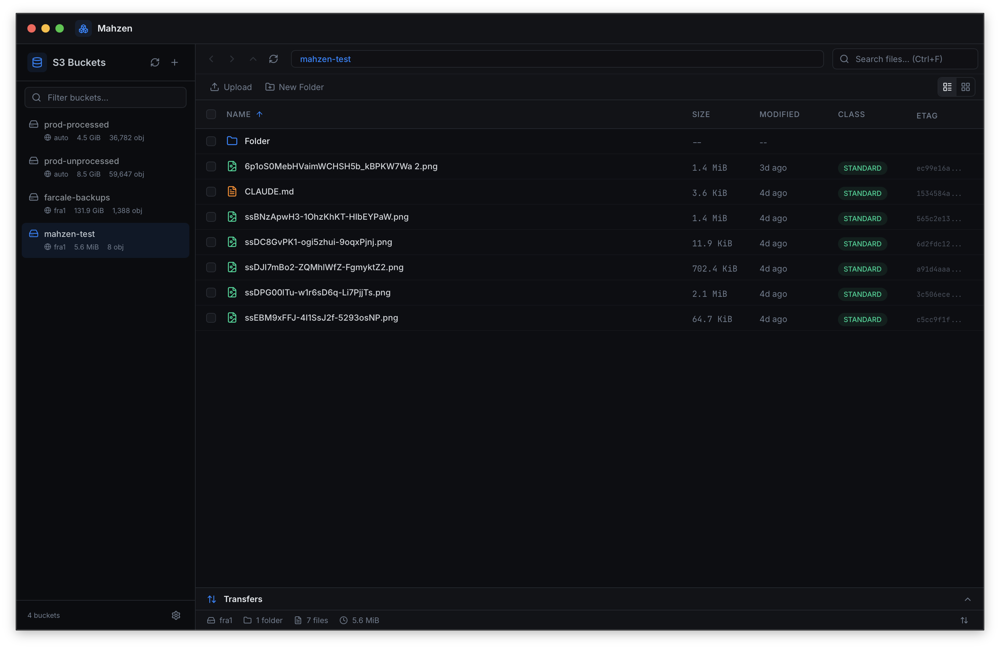

# Mahzen

[](https://github.com/dotyigit/mahzen/releases)
[](./LICENSE)
[](https://github.com/dotyigit/mahzen/actions/workflows/release.yml)
[](https://tauri.app/)
[](https://nextjs.org/)

Mahzen is a native desktop manager for S3 and S3-compatible object storage.

It is built with a Rust backend (`Tauri v2`) and a modern React frontend (`Next.js 16`), and stores app state locally in SQLite.

- Website: [mahzen.dev](https://mahzen.dev)
- Releases: [github.com/dotyigit/mahzen/releases](https://github.com/dotyigit/mahzen/releases)
- Issues: [github.com/dotyigit/mahzen/issues](https://github.com/dotyigit/mahzen/issues)

## Table of Contents

- [What Mahzen Does](#what-mahzen-does)
- [Preview](#preview)
- [Why Mahzen vs Cloud Console](#why-mahzen-vs-cloud-console)
- [Download](#download)
- [First 5 Minutes](#first-5-minutes)
- [Development Setup](#development-setup)
- [Commands](#commands)
- [Architecture](#architecture)
- [Project Structure](#project-structure)
- [Data and Security Notes](#data-and-security-notes)
- [Contributing](#contributing)
- [Release Flow (Maintainers)](#release-flow-maintainers)
- [License](#license)

## What Mahzen Does

### Current features

- Manage multiple storage targets (AWS S3, Cloudflare R2, DigitalOcean Spaces, Hetzner, MinIO, and custom S3-compatible endpoints)
- Save target credentials and test target connectivity before use
- List buckets and browse objects with prefix navigation and pagination
- Upload files/folders and download files or multi-selection as ZIP
- Create folders, delete objects, inspect metadata, and generate presigned URLs
- Track transfers with progress updates and terminal-state cleanup
- Run clone jobs between buckets/prefixes with pause/resume/cancel/retry-failed controls
- Build and browse local bucket indexes for faster large-bucket navigation
- Create and manage sync profile configurations (target, path, schedule, include/exclude rules)
- Customize app behavior in settings (UI, transfer, and safety preferences)

### Scope note

Mahzen is in active development. Sync profile CRUD is implemented; a full sync execution scheduler is not yet exposed as a public command flow.

## Preview



Static screenshots are totally fine for now and keep the README lightweight.

## Why Mahzen vs Cloud Console

- One workspace for many S3-compatible targets instead of provider-by-provider console hopping
- Desktop-native bucket and object workflows (upload, download, ZIP, delete, presign) from a single UI
- Built-in operational tooling (transfer queue, clone jobs, index status) for repetitive storage tasks
- Local-first persistence in SQLite so targets, settings, and workflow state stay on your machine
- Better day-to-day ergonomics for teams handling multi-provider object storage

## Download

### Option 1: Website

Go to [mahzen.dev](https://mahzen.dev) and follow the download links for your platform.

### Option 2: GitHub Releases

Download signed binaries from [Releases](https://github.com/dotyigit/mahzen/releases).

### Option 3: Homebrew (macOS)

```bash
brew install --cask dotyigit/tap/mahzen
```

If Homebrew is not available for your setup yet, use GitHub Releases.

## First 5 Minutes

1. Install Mahzen from [mahzen.dev](https://mahzen.dev) or [GitHub Releases](https://github.com/dotyigit/mahzen/releases).
2. Open Mahzen and click **Add Source**.
3. Pick your provider (AWS S3, R2, MinIO, or custom endpoint) and enter endpoint, region, and credentials.
4. Click **Test Connection**, then save the source.
5. Select a bucket from the sidebar and open a folder/prefix.
6. Try one upload and one download so you can confirm transfer progress behavior.
7. Generate a presigned link for any object to validate your sharing workflow.

## Development Setup

### Prerequisites

- Node.js LTS (20+ recommended)
- npm
- Rust stable toolchain (`rustup`, 1.83+)
- Tauri build prerequisites for your OS: [Tauri setup guide](https://tauri.app/start/prerequisites/)

Linux (Ubuntu 22.04+) packages used by CI/build:

```bash
sudo apt-get update
sudo apt-get install -y libwebkit2gtk-4.1-dev libappindicator3-dev librsvg2-dev patchelf
```

### Run locally

```bash
git clone https://github.com/dotyigit/mahzen.git
cd mahzen
npm install
npm run tauri:dev
```

This starts the full desktop app (Next.js frontend + Tauri/Rust backend).

## Commands

| Command | Description |
| --- | --- |
| `npm install` | Install frontend dependencies |
| `npm run tauri:dev` | Run the desktop app in development |
| `npm run dev` | Run web-only frontend at `http://localhost:3000` |
| `npm run lint` | Run ESLint |
| `npm run tauri:build` | Build production desktop bundles |
| `npm run release -- <version>` | Bump versions, create commit and `v<version>` tag |

### Web-only mode note

`npm run dev` is useful for frontend work, but native Tauri commands are unavailable there.
If you need storage operations, use `npm run tauri:dev`.

## Architecture

Mahzen follows a two-layer desktop architecture:

```text
React UI (Next.js) -> src/lib/tauri.ts invoke wrappers -> Rust Tauri commands -> SQLite + AWS S3 SDK
```

- Frontend: `src/` (App Router, React 19, shadcn/ui + Tailwind)
- Native backend: `src-tauri/` (Tauri commands, Rust core modules)
- Persistence: local SQLite in app data (`mahzen.sqlite`)

## Project Structure

```text
src/                    Next.js frontend (UI, contexts, state wrappers)
src-tauri/              Rust backend (commands, storage, S3/clone/index engines)
docs/                   Internal architecture notes and drafts
website/                Marketing/docs website project
scripts/                Maintenance scripts (version bump/tag)
```

## Data and Security Notes

- App state is local-first and stored in SQLite under your OS app-data directory.
- On macOS this is typically: `~/Library/Application Support/dev.mahzen/mahzen.sqlite`.
- Target credentials are currently persisted in the local database (`target_credentials` table).
- There is no dedicated keychain-backed credential store in this codebase yet.

Recommended best practices:

- Use scoped IAM/API credentials with least privilege.
- Avoid long-lived root credentials.
- Protect your local OS account and disk.

## Contributing

Contributions are welcome.

1. Open an issue for bugs or feature proposals.
2. Fork and create a branch.
3. Run `npm run tauri:dev` and validate your changes manually.
4. Run `npm run lint`.
5. Open a pull request with context and screenshots if UI-related.

Notes:

- There is currently no automated test suite configured.
- Prefer small, focused PRs.

## Release Flow (Maintainers)

- Tag pushes matching `v*` trigger `.github/workflows/release.yml`.
- The workflow builds platform artifacts and publishes a GitHub Release.
- Updater artifacts (`latest.json` + signatures) are published for Tauri updater support.
- Homebrew cask metadata is updated via `dotyigit/homebrew-tap` when release artifacts are available.

Version bump helper:

```bash
npm run release -- 0.2.0
git push && git push origin v0.2.0
```

## License

MIT. See [`LICENSE`](./LICENSE).
